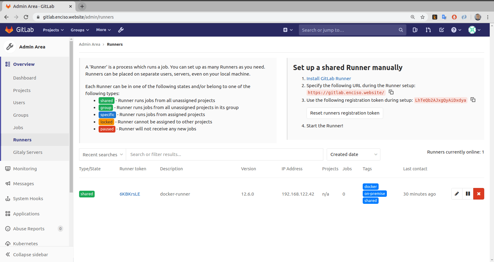

## Gitlab runner-server

This is a playbook to provision gitlab runners

### Install

```
ansible-playbook site-common.yml -i inventory
ansible-playbook site.yml -i inventory
```

### Demo 


### Scale

Provision another VM and run again the same steps


